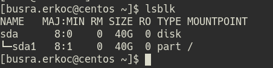
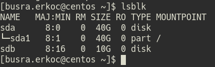
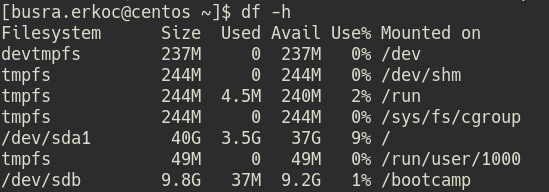
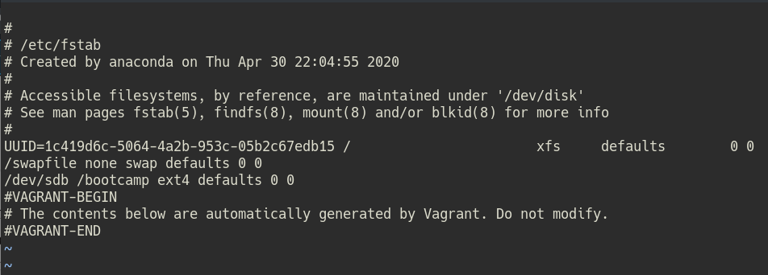

## Case 1

The case will implement the following configuration:

| Machine  Name | Role          | Network Configuration                  | OS                         |
|---------------|---------------|----------------------------------------|----------------------------|
|  centos       |    vm         | private_network, ip: 192.168.135.10    | Centos 7   |

## Prerequisites

* Vagrant 2.2.15 
* Virtualbox 6.1.18

## Getting Started

* Clone this repo

```
$ git clone https://github.com/busraerkoc/devops.git
```

1. Create Centos VM with vagrant and connect to machine with ssh. Check the updates. If kernel updates available, you must reboot the machine after update.

```
$ vagrant up
$ vagrant ssh centos
$ sudo yum check-update | grep -i kernel   # check the kernel updates
$ sudo yum -y update
$ reboot                                   # root password: vagrant
$ vagrant ssh centos                       # after rebooting you need to reconnect to the machine
```

2. Create a user as a name.surname and switch to that user:

```
$ sudo -i  
$ adduser busra.erkoc
$ passwd busra.erkoc
$ usermod -aG wheel busra.erkoc
$ cd /etc/sudoers.d
$ su - busra.erkoc
```

3. Add 10gb disk as a second disk and mount it as "bootcamp"

* Check the available disks

```
$ lsblk
```



* Stop the machine, because Virtualbox not allow add new disk when the machine is running.

```
$ vagrant halt
```
* Add Second Disk from VirtualBox GUI

Go to VirtualBox GUI.  
Select your virtual machine.  
Settings -> Storage -> Controller: IDE -> Adds hard disk -> Create  
Create Virtual Hard Disk -> VDI(VirtualBox Disk Image) -> Dynamically allocated -> Size: 10GB  
After creating the disk, select the created disk.  

* Start again Virtual Machine

```
$ vagrant up
$ vagrant ssh centos
$ su - busra.erkoc
```

* Check available disks

```
$ lsblk
```



* Create a hard disk partition :

```
$ sudo fdisk /dev/sdb
> p         # Print partition table
> n         # to add new partition
> p         # Select primary
> 1         # Partition number
> +10GB
> w         # to write changes
```

* Create the filesystem on a partition.

```
$ mkfs -t ext4 /dev/sdb
```

* Mount the new filesystem to /bootcamp

```
$ sudo mkdir -p /bootcamp
$ sudo mount /dev/sdb /bootcamp
```

* Check

``` 
$ df -h
```


* To permanently mounting filesystem :

```
$ sudo vi /etc/fstab
Add this line : 
/dev/sdb     /bootcamp   ext4   default 0 0 
```


4. Create bootcamp.txt file inside /opt/bootcamp

```
$ sudo mkdir -p /opt/bootcamp ; sudo touch /opt/bootcamp/bootcamp.txt ; sudo chown busra.erkoc: bootcamp.txt ; echo "merhaba trendyol" >> /opt/bootcamp/bootcamp.txt
```

5. Finding the bootcamp.txt file using a single command in the personal user's home directory and moving it to the bootcamp disk :

```
$ sudo chown busra.erkoc: /bootcamp ; find / -name bootcamp.txt -exec mv {} /bootcamp \;
```