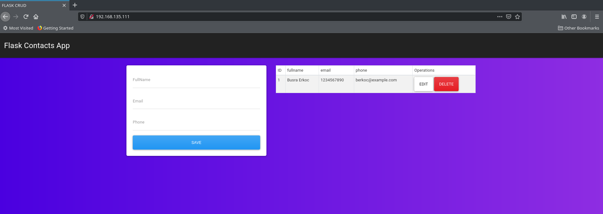

# Case 2

I created an extra docker-compose file for this case and you can find it in this repo as docker-compose.yml.

The case will implement the following configuration:


| Machine  Name | Role          | Network Configuration                  | OS                         |
|---------------|---------------|----------------------------------------|----------------------------|
| control       | Ansible  host | private_network, ip: 192.168.135.10    | Ubuntu Focal64 (20 LTS)   |
| app           | app           | private_network, ip: 192.168.135.111   | Ubuntu Focal64 (20 LTS)   |


## Prerequisites

* Vagrant 2.2.15 
* Virtualbox 6.1.18

## Getting Started

* Clone this repo

```
$ git clone https://github.com/busraerkoc/devops.git
```

* Create Virtual Machines

```
$ vagrant up
```

* Connect to control machine with ssh

```
$ vagrant ssh control
```

* Download required ansible role

```
$ cd /vagrant/
$ ansible-galaxy install geerlingguy.docker
```

* Run playbook and thus application will run

```* 
$ ansible-playbook playbook.yml
```



## References

* https://github.com/bilalcaliskan/vagrant-ansible-lab
* https://github.com/FaztWeb/flask-crud-contacts-app
* https://galaxy.ansible.com/geerlingguy/docker